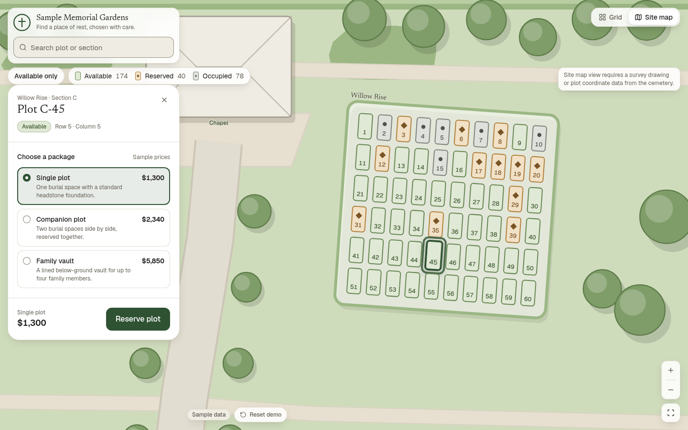
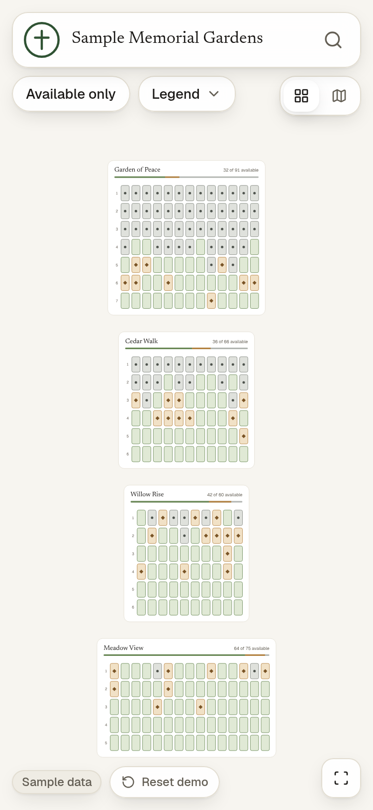
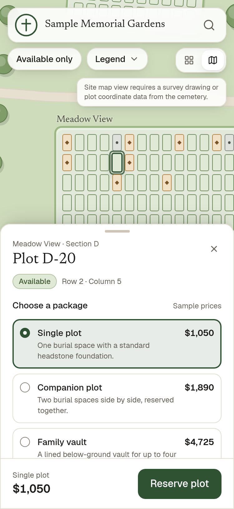
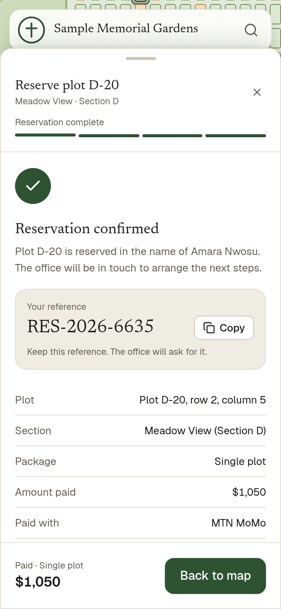
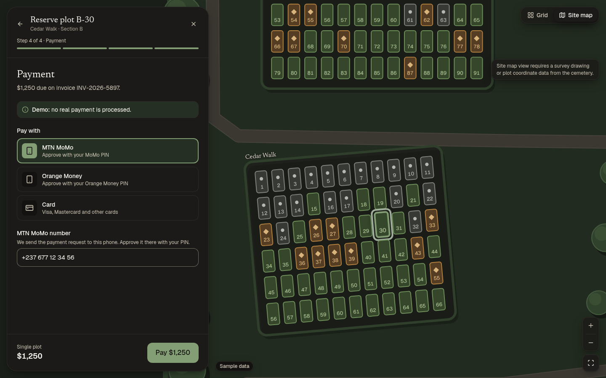

# Plotview

Plotview is an open-source cemetery plot selector: families explore a map of the cemetery, find an available plot, choose a package, pay and receive a confirmation. The whole cemetery is described in one JSON file, so a real site plan replaces the sample without any code changes.

**Live demo: [plotview-demo.vercel.app](https://plotview-demo.vercel.app)**. It runs on sample data, and no real payment is processed.



<table>
  <tr>
    <td></td>
    <td></td>
    <td></td>
  </tr>
</table>



> **A note on scope.** This demo shows a complete self-service journey, from choosing a plot to paying for it, to show what that feature could look like. It is deliberately more capable than a typical first deployment, where the public journey covers plot enquiries and reservation and payment happen after a member of staff is involved. Read the reserve and pay flow as a picture of what is possible, not as a description of what any particular platform does.

## What it does

- **Two map views**, switched from the top corner. The grid view shows each section as a block of rows and columns and needs no spatial data. The site map view draws the grounds, paths, trees, buildings and rotated sections as they sit on the site, and morphs every plot between the two.
- **Explore and find**: pan and pinch-zoom, search by plot id or section name, and an "Available only" filter. Plot status is shown by colour and a glyph, never by colour alone.
- **Shareable selection**: the selected plot is kept in the URL (`?plot=C-45`) and restored when the link is opened.
- **Plot details** in a side panel on wide screens and a draggable bottom sheet on phones, with each package's price.
- **Reserve in steps**: package, buyer details, an invoice issued before payment, payment, and a confirmation with a reference number. Going back keeps what was entered.
- **Simulated payments** for MTN MoMo, Orange Money and card, each behind the same `PaymentProvider` interface.
- **The map remembers**: a reserved plot stays reserved after a refresh, and a Reset demo control clears everything.
- **Built to be used by everyone**: works with the keyboard alone, supports screen readers, respects reduced motion, and has light and dark themes. It was checked with axe against WCAG 2.2 AA at phone, tablet and desktop widths.

## Run it locally

You need Node.js 20.9 or later.

```bash
git clone https://github.com/oladokun-o/plotview.git
cd plotview
npm install
npm run dev
```

Open [http://localhost:3000](http://localhost:3000).

| Command | What it does |
| --- | --- |
| `npm run dev` | Development server with hot reload |
| `npm run build` | Production build |
| `npm start` | Serves the production build |
| `npm run lint` | ESLint |
| `npm run generate:layout` | Regenerates the sample cemetery in `src/data/layout.json` |

There is no backend and nothing to configure. Any host that runs Next.js works; the demo is deployed on Vercel.

## Use your own cemetery layout

The entire cemetery is defined in one file: **`src/data/layout.json`**. The app renders any valid layout without code changes, so replacing the sample with a real site means editing that file only. Its shape is defined, with comments on every field, in [`src/types/layout.ts`](src/types/layout.ts).

### The smallest layout

Sections, plots and packages are all the grid view needs:

```json
{
  "site": { "name": "Example Cemetery", "currency": "USD", "width": 200, "height": 120 },
  "sections": [
    {
      "id": "A",
      "name": "North lawn",
      "x": 20,
      "y": 20,
      "rows": 2,
      "cols": 3,
      "plotSize": 14,
      "plotLength": 26,
      "gap": 6,
      "plots": [
        { "id": "A-1", "row": 1, "col": 1, "status": "occupied", "basePrice": 1200 },
        { "id": "A-2", "row": 1, "col": 2, "status": "reserved", "basePrice": 1200 },
        { "id": "A-3", "row": 1, "col": 3, "status": "available", "basePrice": 1200 },
        { "id": "A-4", "row": 2, "col": 1, "status": "available", "basePrice": 1100 },
        { "id": "A-5", "row": 2, "col": 2, "status": "available", "basePrice": 1100 },
        { "id": "A-6", "row": 2, "col": 3, "status": "available", "basePrice": 1100 }
      ]
    }
  ],
  "packages": [
    { "id": "single", "name": "Single plot", "description": "One burial space.", "priceMultiplier": 1 },
    { "id": "companion", "name": "Companion plot", "description": "Two spaces side by side.", "priceMultiplier": 1.8 }
  ]
}
```

With no spatial data, the app shows the grid view only and hides the view toggle.

### Fields

| Field | Required | What it is |
| --- | --- | --- |
| `site` | Yes | `name`, `currency` (an ISO 4217 code such as `"USD"`), and `width` and `height` of the site's coordinate space |
| `sections` | Yes | At least one. Each has an `id` (`"A"`), a `name`, a position (`x`, `y`, and an optional `rotation` in degrees clockwise around its top-left corner), `rows`, `cols`, the plot size (`plotSize` across a row, optional `plotLength` along a column), the `gap` between plots, and its `plots` |
| `plots` | Yes | Inside each section. An `id` unique across the whole layout (`"A-12"`), a 1-based `row` and `col`, a `status`, and a `basePrice` |
| `packages` | Yes | At least one. An `id`, `name`, `description` and `priceMultiplier`. A package costs the plot's `basePrice` × `priceMultiplier` |
| `grounds` | No | Areas drawn under everything: `lawn`, `gravel`, `water` or `planting`, each a closed polygon of `points` |
| `paths` | No | A `road` or `footpath` with a `width`, drawn along a line of `points` |
| `landmarks` | No | A `gate`, `chapel`, `office`, `parking` or `other` building, with a `label`, a position and size, and an optional `rotation` around its centre |
| `trees` | No | A position and a canopy `radius` |
| `underlay` | No | A real aerial photo or survey drawing placed under the site map: an image path under `public/`, its position and size, and an optional `opacity` from 0 to 1 |

- **Coordinates** share one space for the whole site: origin at the top left, y pointing down. The units are up to you as long as they are consistent; the sample uses about 10 cm per unit.
- **Status**: `available` plots can be reserved. `reserved` and `occupied` plots can be selected and viewed but not reserved.
- **Site map view**: it appears as soon as the layout has any `grounds`, `paths` or `landmarks`. Without an `underlay` it is drawn as an illustrated plan from those fields. The grid view ignores all spatial fields.
- **Names**: the header shows `siteName` from the branding file, described below; `site.name` names the layout itself.

### Validation

The layout is checked when the app loads. If anything is wrong, the app shows an error screen naming the exact field and the problem instead of a broken map. For example:

```
Where:    layout.sections[1].plots[4].status
Problem:  Expected one of "available", "reserved", "occupied", got "sold"
```

Beyond the types, the checks are:
- `id`s are unique within each list, and plot ids are unique across the whole layout.
- Every plot's `row` and `col` fall inside its section, and no two plots share a cell. Cells can be left empty.
- Sizes and prices are greater than 0 and `gap` is 0 or more.
- Grounds have at least 3 points and paths at least 2.

The sample itself is generated by [`scripts/generate-sample-layout.mjs`](scripts/generate-sample-layout.mjs). You don't need the script to use your own data.

## Rebrand it

Branding lives in one file: **`src/data/branding.json`**.

```json
{
  "siteName": "Sample Memorial Gardens",
  "tagline": "Find a place of rest, chosen with care.",
  "primaryColor": "#2f5233",
  "logoPath": "/logo.svg"
}
```

| Field | Used for |
| --- | --- |
| `siteName` | The name in the header and the browser tab |
| `tagline` | The line under the name on wide screens, and the page description |
| `primaryColor` | Buttons, selection and focus. Choose a colour dark enough for white text on it (at least 4.5:1); dark mode derives a lighter accent from it automatically |
| `logoPath` | The logo in the header and the favicon. Put the file in `public/` |

Every colour in the interface comes from design tokens in [`src/styles/tokens.css`](src/styles/tokens.css): raw palette values, then semantic tokens (surface, text, border, status, accent), which the components use. Branding overrides only the brand colour, so the rest of the palette stays balanced whatever it is set to.

## What this demo does not do

- **No accounts or login.**
- **No server or database.** Reservations are kept in the visitor's own browser (`localStorage`), so other visitors and other devices never see them.
- **No real payments.** MTN MoMo, Orange Money and card are simulated. Card details are never stored or sent anywhere.
- **No emails or text messages.** The confirmation exists only on screen.
- **Reference and invoice numbers are made up in the browser** and can repeat. A real system would issue them from a server.
- **No staff or admin dashboard**, no enquiry inbox and no way to edit plots from the app. Statuses come from the layout file.
- **No burial records, memorial pages or grave search.**
- **Every price and plot is sample data**, and screens that show them say so.

## How it is built

- **Next.js** (App Router) and **TypeScript** in strict mode.
- **Tailwind CSS v4**, with colours only from theme tokens.
- **Both map views are SVG**, sharing one pan and pinch-zoom layer (`react-zoom-pan-pinch`). One renderer is what lets a plot morph from its grid slot to its place on the site, and it keeps a canvas library out of the bundle.
- **`motion`** for panels, the bottom sheet and step transitions, loaded lazily.

```
src/
  app/                 page and root layout
  components/
    map/               map shell, floating controls, search, legend, camera
    map/grid/          grid view
    map/sitemap/       site map view: grounds, paths, trees, landmarks, sections
    panel/             side panel and bottom sheet
    reserve/           the reserve steps
    payment/           payment method forms and states
    ui/                design system primitives: button, chip, field, badge...
  data/                layout.json and branding.json
  lib/
    layout.ts          loads and validates the layout
    payments/          PaymentProvider interface and one provider per method
    store.ts           app state, saved to localStorage
  styles/              design tokens and motion
  types/               layout and branding types
```

Payments follow the shape of a production integration. The interface is in [`src/lib/payments/types.ts`](src/lib/payments/types.ts): a provider gives the form's starting details, validates them in plain language, and takes the payment, reporting progress and supporting cancellation. The UI only ever talks to that interface. Replacing a simulated provider with a real gateway would not touch the screens.

## Licence

[MIT](LICENSE) © 2026 Nxtedge Studio
